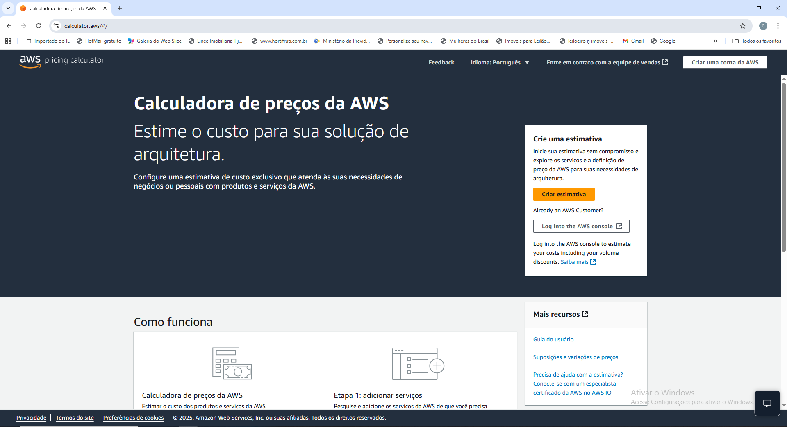
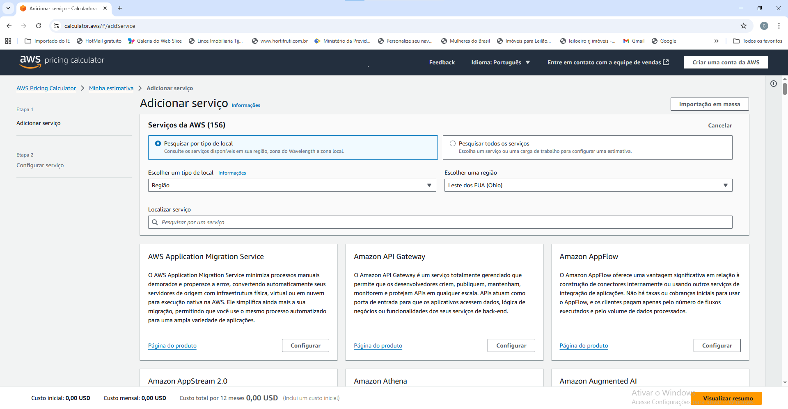
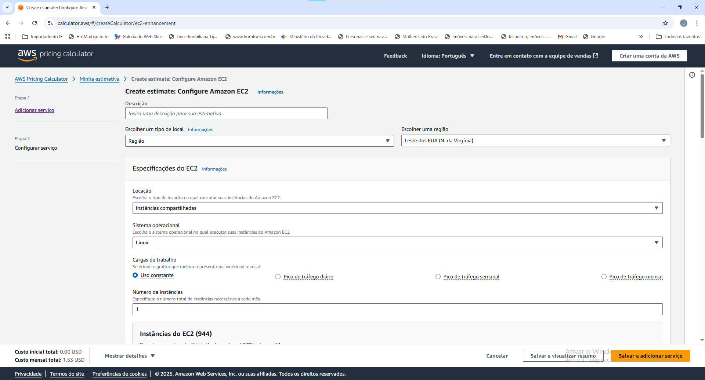
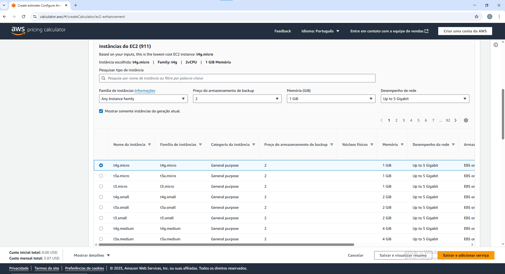
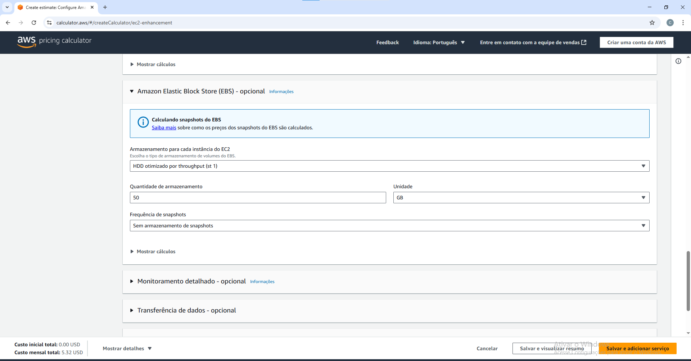
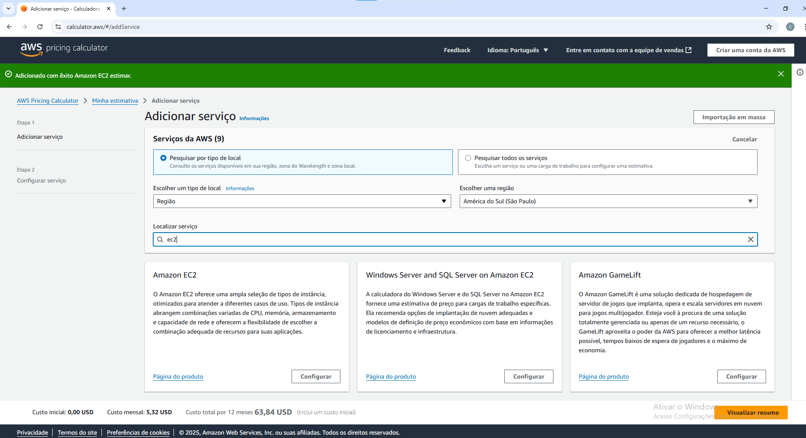
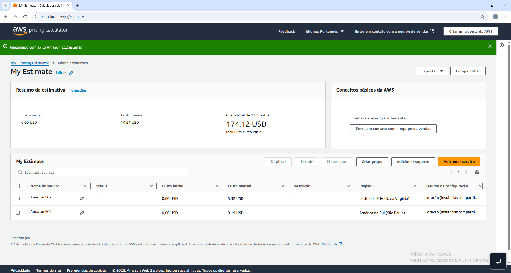

# FIAP - Faculdade de Informática e Administração Paulista

 

# FarmTech na era da cloud computing

## Nome do grupo

## 👨‍🎓 Integrantes: 
- <a href="https://www.linkedin.com/in/arthur-alentejo">Arthur Guimarães Alentejo</a>
- <a href="https://www.linkedin.com/in/michaelrodriguess">Michael Rodrigues</a>
</a> 
- <a href="https://www.linkedin.com/in/nathalia-vasconcelos-18a390292/">Nathalia Vasconcelos</a> 

## 👩‍🏫 Professores:
### Tutor(a) 
- <a href="https://www.linkedin.com/company/inova-fusca">Lucas Gomes Moreira</a>
### Coordenador(a)
- <a href="https://www.linkedin.com/company/inova-fusca">Andre Godoi</a>

## 📜 Descrição

Este projeto tem como objetivo aplicar conceitos de Marchine Learning e Computação em Nuvem no contexto do agronegócio, focando especificamente na inovação tecnológica do setor com metodologias para predição de produção utilizando cinco modelos de preditivos e verificando o mais ajustado aos tipos de dados.

A base de dados utilizadas está disponível na pasta document e contém as variáveis abaixo listadas. 
- Cultura: o nome da safra para a qual o rendimento está sendo medido.
- Precipitação (mm dia 1): a quantidade de chuva em milímetros por dia.
- Umidade específica a 2 metros (g/kg): a quantidade de vapor de água no ar por quilograma de ar seco a uma altura de 2 metros acima do solo.
- Umidade relativa a 2 metros (%): a quantidade de vapor de água no ar como uma porcentagem da quantidade máxima de vapor de água que pode ser mantida a uma determinada temperatura e pressão.
- Temperatura a 2 metros (ºC): a temperatura em graus Celsius a uma altura de 2 metros acima do solo.
- Rendimento: a quantidade de rendimento em toneladas por hectare.

Na parte de computação em nuvem, considerando a necessidade de hospedar uma API que receberá dados dos sensores que coletam as variáveis acima e onde rodará a Machine Learning, foi realizada uma estimativa de custos (On-Demand – 100%) para usar uma máquina Linux simples, comparando os valores cotados para a região de São Paulo (BR) e para a região da Virgínia do Norte (EUA). 

A cotação foi realizada utilizando o site https://calculator.aws/#/

Acessando o botão amarelo de criar estimativa, abre-se a seguinte tela:

Inicialmente foi selecionada a região Leste dos EUA (N. da Virginia) e o produto Amazon EC2, pois ele abrangem combinações variadas de CPU, memória, armazenamento e capacidade de rede.

Iniciou-se a configuração do produto:

Optou-se por uma única instância de uso constante e compartilhado. 

Realizada a configuração considerando :
2 CPUs.
1 GIB de memória.
Até 5 Gigabit de rede.

Além de 50 GB de armazenamento (HD).

Salvou-se e incluiu um serviço na cotação, considerando a mesma configuração mas com a região de América do Sul (São Paulo).

Com a cotação prota, verificou-se que o custo para a hospedagem no Leste dos EUA é mais barato que na América do Sul.

Caso haja restrições legais para armazenamento no exterior, mesmo sendo mais caro, a opção por São Paulo seria a única viável.

## 📁 Estrutura de pastas

Dentre os arquivos e pastas presentes na raiz do projeto, definem-se:

- <b>.github</b>: Nesta pasta ficarão os arquivos de configuração específicos do GitHub que ajudam a gerenciar e automatizar processos no repositório.

- <b>assets</b>: aqui estão os arquivos relacionados a elementos não-estruturados deste repositório, como imagens.

- <b>config</b>: Posicione aqui arquivos de configuração que são usados para definir parâmetros e ajustes do projeto.

- <b>document</b>: aqui estão todos os documentos do projeto que as atividades poderão pedir. Na subpasta "other", adicione documentos complementares e menos importantes.

- <b>scripts</b>: Posicione aqui scripts auxiliares para tarefas específicas do seu projeto. Exemplo: deploy, migrações de banco de dados, backups.

- <b>src</b>: Todo o código fonte criado para o desenvolvimento do projeto ao longo das 7 fases.

- <b>README.md</b>: arquivo que serve como guia e explicação geral sobre o projeto (o mesmo que você está lendo agora).

## 🔧 Como executar o código

O código e a explicação da sua execução encontram-se no Jupiter disponível na pasta src.

## 🗃 Histórico de lançamentos

* 0.1.0 - 28/08/2025
    *

## 📋 Licença

<a property="dct:title" rel="cc:attributionURL" href="https://github.com/agodoi/template">MODELO GIT FIAP</a> por <a rel="cc:attributionURL dct:creator" property="cc:attributionName" href="https://fiap.com.br">Fiap</a> está licenciado sobre <a href="http://creativecommons.org/licenses/by/4.0/?ref=chooser-v1" target="_blank" rel="license noopener noreferrer" style="display:inline-block;">Attribution 4.0 International</a>.

